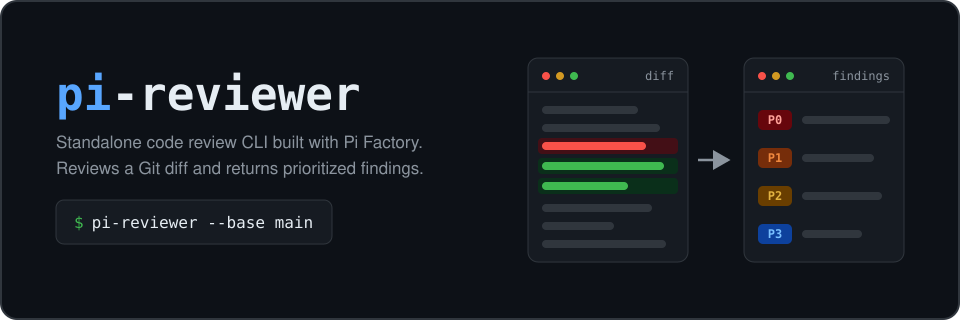

# omp-reviewer

<p align="center">
  
</p>

omp-reviewer is a standalone code review CLI for [Oh My Pi](https://omp.sh). It reviews a Git diff in a fresh `omp` process and returns prioritized P0 through P3 findings in the same shape as standalone `codex review`.

## Install

Install omp-reviewer from npm:

```bash
npm install -g @ericjuta/omp-reviewer
```

Or run it once with `npx`:

```bash
npx @ericjuta/omp-reviewer --base main
```

To build from source instead:

```bash
git clone https://github.com/ericjuta/omp-reviewer.git
cd omp-reviewer
npm ci
npm run build
npm link
```

## Configure a model

omp-reviewer has no model identifier in its review extension. Set the default outside the extension:

```bash
omp-reviewer config set model openai-codex/gpt-5.6-terra
omp-reviewer config set thinking high
```

The optional user config lives at `~/.config/omp-reviewer/config.json`. A command-line model or thinking level overrides it for one run:

```bash
omp-reviewer --model openai-codex/gpt-5.6-sol --thinking high --base main
```

omp-reviewer selects the provider implementation, model data, and existing authentication from the
main OMP profile:

```bash
omp-reviewer models gpt-5.6
```

The model in Reviewer config applies only to omp-reviewer. It does not change normal OMP's selected
provider or model. Prompts, tools, context files, sessions, repository policy, and review lifecycle
remain isolated.

Credentials stay in the OMP agent store (`~/.omp/agent`). `omp-reviewer login` runs `omp login`.

```bash
omp-reviewer config set model huggingface/moonshotai/Kimi-K3:fireworks-ai
omp-reviewer config set thinking high
```

If OMP has no Hugging Face credential yet, run `omp-reviewer login huggingface` or `omp login huggingface`.

For a model that is not yet in OMP's catalog, pass a strict model manifest. The selected provider and model must match the manifest. `apiKeyEnv` names an environment variable; the manifest does not contain the credential.

```json
{
  "version": 1,
  "provider": {
    "id": "example",
    "baseUrl": "https://api.example.com/v1",
    "apiKeyEnv": "EXAMPLE_API_KEY",
    "compat": { "supportsDeveloperRole": false }
  },
  "model": {
    "id": "organization/model:route",
    "name": "Model via pinned route",
    "reasoning": true,
    "input": ["text"],
    "contextWindow": 131072,
    "maxTokens": 32768,
    "cost": { "input": 0.1, "output": 0.2, "cacheRead": 0, "cacheWrite": 0 }
  }
}
```

```bash
omp-reviewer --model example/organization/model:route \
  --model-manifest ./model.json --base main
```

## Review

```bash
omp-reviewer --uncommitted
omp-reviewer --base main
omp-reviewer --commit <sha>
omp-reviewer "focus on cancellation safety"
```

The command writes progress to stderr and the final report to stdout. Use `--format json` to emit the validated Codex-compatible result object without terminal prose:

```bash
omp-reviewer --base main --format json > review.json
```

Use `--metrics-file` to record cumulative token use and the provider and model reported by OMP. The file is refreshed after each model response, including during a review that later fails.

```bash
omp-reviewer --base main --format json --metrics-file ./review-metrics.json > review.json
```

Every review saves an OMP session under `~/.local/state/omp-reviewer/sessions` unless you pass `--no-session`. Sessions can contain reviewed source code and tool output, so protect and retain them like the repository itself.

Integrations can isolate a run with `--session-dir DIR` and write compact receipts with `--session-receipt PATH` and `--lifecycle-receipt PATH`. Receipts record the session directory and outcome only. They do not contain prompts, source text, assistant text, tool arguments, or credentials. `--no-session` cannot be combined with session output options.

omp-reviewer treats `--time-budget` as the exploration limit (default 10 minutes). If that `omp -p` turn does not call `submit_review`, omp-reviewer resumes the same session with `--continue` and a submit-only prompt for `--finalization-grace` (default 2 minutes). There is no second fabricated result and no prose fallback.

```bash
omp-reviewer --base main \
  --time-budget 30m \
  --time-warning 50% \
  --time-warning 10m \
  --finalization-grace 10m
```

Final review output must come through `submit_review`. Raw JSON or assistant prose is not accepted.

Before schema validation, omp-reviewer shortens finding titles longer than 80 Unicode characters. It can also fill a missing numeric priority when the title starts with an exact `[P0]` through `[P3]` prefix. Missing review content, conflicting priorities, invalid scores or ranges, unsafe paths, extra fields, and other malformed output still fail.

A successful review returns zero even when it has findings. Invalid targets, missing `omp`, authentication failures, model failures, a missing `submit_review`, or cancellation return nonzero. omp-reviewer never fabricates a clean result.

The CLI spawns the installed `omp` binary in print mode. Auth comes from the regular OMP profile (`~/.omp/agent`, or `OMP_PROFILE`). Do not pass `--profile` for isolation; that empties credentials. Tools can inspect only the current checkout. Guarded command subprocesses receive a minimal environment. Mutation, network clients, shell operators, external Git helpers, and paths outside the checkout are blocked.

## Codex compatibility

omp-reviewer vendors Codex's review rubric and target prompt wording from commit `fa1d4c40d0e63eef2e0ba8a9e004ccd0a80b77f5`. [`UPSTREAM.md`](docs/UPSTREAM.md) records the exact sources and local changes. [`CODEX-COMPARISON.md`](docs/CODEX-COMPARISON.md) compares the commands and gives the same-branch verification procedure. [`CASE-STUDY.md`](docs/CASE-STUDY.md) records a paired comparison on two historical snapshots with known defects.

Both tools support custom instructions and the same review targets. A target can cover uncommitted changes or compare against either a base branch or one commit. Both return findings with a title, body, confidence, priority, location, correctness verdict, and overall confidence. omp-reviewer requires every finding to contain a P0 through P3 priority and fails closed on malformed output.

## Development

```bash
npm run check
npm run slophammer
```

Mutation testing is available through `npm run mutate` but is not part of normal completion checks.

## License

[MIT](LICENSE)
